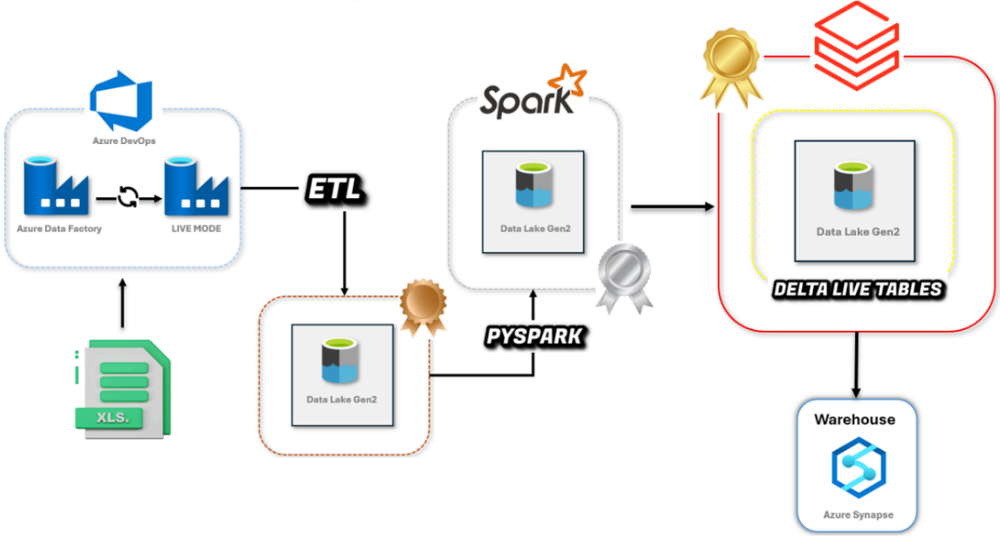
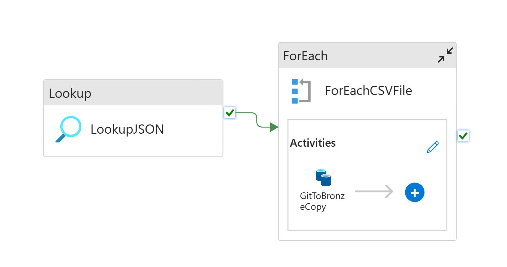
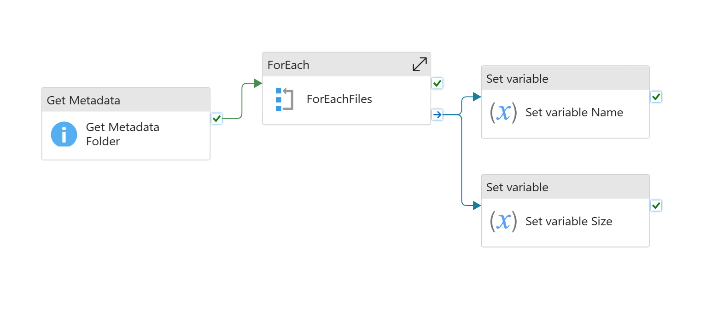
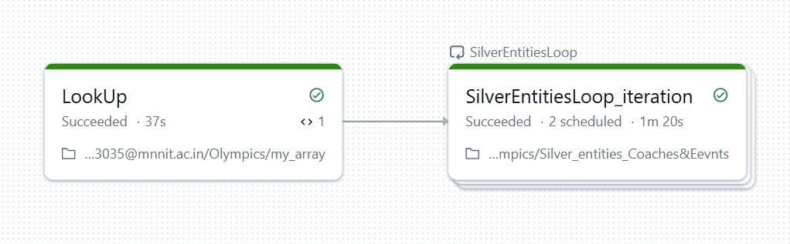
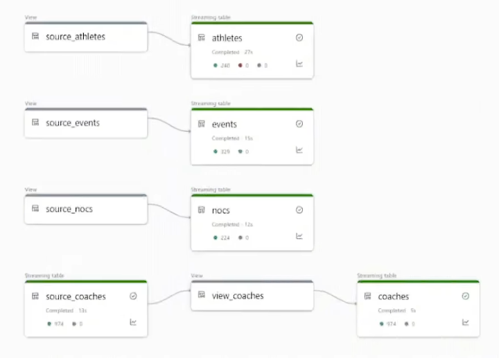

## Azure Data Engineering Project

This is an end-to-end Azure-based Data Engineering pipeline following the **Medallion Architecture (Bronze → Silver → Gold)**, built using tools like **Azure Data Factory, Databricks, Pyspark, Delta Lake, Unity Catalog, and Delta Live Tables (DLT)**. The project also uses **Azure DevOps Git** for version control of ADF pipelines.

---

## Tools & Services Used

| Category       | Tools / Services                                |
|----------------|--------------------------------------------------|
| Cloud Platform | Azure                                             |
| Data Movement  | Azure Data Factory (ADF)                          |
| Processing     | Azure Databricks, PySpark                         |
| Storage        | Azure Data Lake Storage Gen2 (ADLS Gen2)         |
| Lakehouse      | Delta Lake, Delta Live Tables                    |
| Governance     | Unity Catalog, Access Connector                  |
| CI/CD (ADF)    | Azure DevOps                                     |
| File Formats   | CSV → Parquet → Delta                            |

---

## Project Architecture

This is the high-level architecture of the project.

---

## Step 1: GitHub + Azure Data Lake + Azure Data Factory – Ingest to Bronze Layer

We created two Azure Data Factory pipelines to ingest raw data into the **Bronze layer** (stored in ADLS Gen2).

1. `GitToBronze`: Pulls 3 files directly from GitHub and lands them into the Bronze container.
2. `DataLakeIngestion`: Pulls 1 file from an Azure Data Lake source into the Bronze layer.

### Git to Bronze Pipeline  

### Data Lake Ingestion Pipeline  

---

## Step 2: Bronze to Silver (Azure Databricks + Pyspark + Unity Catalog)

We used **Azure Databricks** and **PySpark** to process raw data from the Bronze layer. The clean, validated data is saved in the **Silver layer** in **Delta format**.

- Accessed external Bronze data using **Unity Catalog** + External Locations.
- Performed joins, type casting, and null filtering.
- Stored curated data in Silver tables using **managed Unity Catalog databases**.

### Bronze to Silver Workflow  

---

## Step 3: Silver to Gold (Delta Live Tables + CDC)

We used **Delta Live Tables (DLT)** for real-time curation from Silver to Gold.

- Enabled **Change Data Capture (CDC)** using `apply_changes()` api on DLT.
- Applied **data quality checks** using `expectations` to handle bad records.
- Final curated tables are saved in the **Gold layer** for downstream analytics.

### DLT Pipeline  

---

## CI/CD with Azure DevOps

- **Azure DevOps Repos Git** was used for version control of ADF pipeline JSON templates.
- Changes made to ADF pipelines are pushed to DevOps and deployed through Git integration.
- This helps maintain **source control** and supports **collaborative development** for ADF workflows.

---

## Key Highlights

- Real-world implementation of **Medallion Architecture** (Bronze → Silver → Gold).
- Ingestion from both **GitHub** and **Azure Data Lake** using **ADF**.
- Hands-on with **PySpark transformations**, **Unity Catalog security**, and **Delta Live Tables**.
- Version control and CI/CD for **ADF pipelines** using **Azure DevOps**.

---

## What I Learned

Working on this project helped me gain practical experience with Azure's modern data engineering stack. Here’s what I learned:

- How to **design and implement Medallion Architecture** in a real-world pipeline.
- Ingesting data from different sources (GitHub and Azure Data Lake) using **ADF pipelines**.
- Implementing **data transformation logic** using PySpark inside **Azure Databricks**.
- Managing data access, locations, and governance using **Unity Catalog**.
- Building **DLT pipelines** with **CDC** and **data quality constraints**.
- Setting up **CI/CD with Azure DevOps** specifically for **ADF** pipeline versioning and automation.
- Best practices for organizing data into **Bronze, Silver, and Gold** layers for scalable analytics.

---

